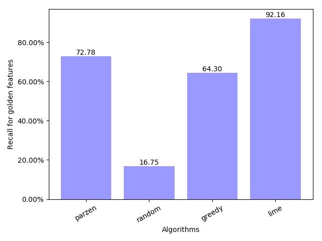

# Reproducing LIME experiments

This repository contains the code to run the experiments present in [this paper](http://arxiv.org/abs/1602.04938). The code here is frozen to what it was when we originally wrote the paper. If you're interested in using LIME, check out [this repository](https://github.com/marcotcr/lime), where we have packaged it up, improved the code quality, added visualizations and other improvements.

**This code was modified by @mari-linhares in order to be easier to reproduce the experiments.**

## What I need in order to run these experiments?

### Install dependencies

You need python, sklearn, numpy, scipy.

## Getting the data

1. Clone or download this repository
2. Run: ```./download_datasets.sh```

The script download_datasets.sh is:

1. Downloading the datasets using the links below, and save them under lime-experiments/

    * [Religion dataset](https://github.com/marcotcr/lime-experiments/blob/master/religion_dataset.tar.gz)
    * [Multi-polarity datasets](https://www.cs.jhu.edu/~mdredze/datasets/sentiment/processed_acl.tar.gz)

2. Unziping the tar files

Now you should have the following directories under lime-experiments/:

```
processes_acl/books/
processes_acl/dvd/
processes_acl/eletronics/
processes_acl/kitchen/

religion_dataset/atheism/
religion_dataset/christianity
```

=======
Running the commands below should be enough to get all of the results. You need specific versions python, sklearn, numpy, scipy. Install requirements in a virtualenv using:

`pip install -r requirements.txt`


## Experiment in section 5.2:

To run (1 time) the experiment present in the paper run:
`python section_5_2.py`

This will print the results in the screen, and output graphs in output_section_5_2/

 
 


### Running each experiment manually

- DATASET -> 'multi_polarity_books', 'multi_polarity_kitchen', 'multi_polarity_dvd',
- ALGORITHM -> 'l1logreg', 'tree'
- EXPLAINER -> 'lime', 'parzen', 'greedy' or 'random'
    
        python evaluate_explanations.py --dataset DATASET --algorithm ALGORITHM --explainer EXPLAINER 

Example:
  
        python evaluate_explanations.py --dataset multi_polarity_books --algorithm l1logreg --explainer random

Output example:
        Explainer: random
        Dataset: multi_polarity_books
        Classifier: l1logreg
        Recall: 0.1472306143

## Experiment in section 5.3:
- DATASET -> 'multi_polarity_books', 'multi_polarity_kitchen', 'multi_polarity_dvd', 'multi_polarity_kitchen'
- ALGORITHM -> 'logreg', 'random_forest', 'svm', 'tree' or 'embforest', although you would need to set up word2vec for embforest

        python data_trusting.py -d DATASET -a ALGORITHM -k 10 -u .25 -r NUM_ROUNDS

## Experiment in section 5.4:
- NUM_ROUNDS -> Desired number of rounds
- DATASET -> 'multi_polarity_books', 'multi_polarity_kitchen', 'multi_polarity_dvd', 'multi_polarity_kitchen'
- PICK -> 'submodular' or 'random'
Run the following with the desired number of rounds:

        mkdir out_comparing

        python generate_data_for_compare_classifiers.py -d DATASET -o out_comparing/ -k 10 -r NUM_ROUNDS

        python compare_classifiers.py -d DATASET -o out_comparing/ -k 10 -n 10 -p PICK
